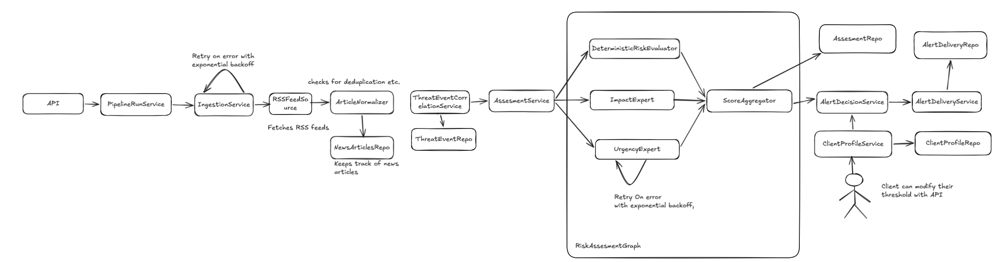

# Threat Alerting System

Threat Alerting System turns cybersecurity RSS entries into explainable,
profile-specific alerts. It ingests configured feeds, normalizes and deduplicates
articles, correlates reports that describe the same CVE, evaluates each threat event
with deterministic rules and two LLM experts, and records why an alert was or was not
created.

The system is designed around evidence rather than headlines. Every completed risk
assessment keeps evaluator scores, reasons, evidence quotes, model and prompt
provenance, disagreement, and content-quality information. Every alert includes a
decision certificate that connects the final outcome back to those inputs.

## How it works



The application runs as a modular monolith. The `Service` classes are application
components, not independently deployed network services. FastAPI, the CLI, and the
offline regression runner reuse the same application services and repository
behavior.

### Event-centric processing

An article is source material, not the final unit of risk. The system extracts every
normalized CVE identifier and creates one stable event key such as
`cve:CVE-2026-12345`. Reports from different sources that mention that CVE are linked
to the same `ThreatEvent`.

When no CVE exists, the canonical URL is used as a deterministic fallback. The
article ID is the final fallback. Correlation intentionally avoids fuzzy or
embedding-based matching, so every merge can be explained.

### Risk assessment

LangGraph fans an event out to three evaluators:

| Evaluator | Responsibility |
| --- | --- |
| `deterministic` | Repeatable evidence-backed baseline scoring |
| `impact_expert` | Organizational impact and blast radius |
| `urgency_expert` | Immediacy, exploitation, exposure, and actionability |

All evaluators answer the same alert-worthiness question and return the same
`RiskResult` contract. A complete result is the exact arithmetic mean of all three
scores. `score_disagreement` is the highest score minus the lowest score.

If a required evaluator fails after bounded retries, the assessment is stored as
`incomplete`. The system never averages only the available subset and never turns a
provider failure into a deterministic-only decision.

### Profile-specific alerts

Risk is assessed once per event and assessment version. Client profiles are applied
afterward, so adding profiles does not cause extra LLM calls.

- Empty vendor, product, and category filters match every event.
- Non-empty filters match when at least one normalized profile value intersects the
  corresponding event values.
- An alert is created only when `average_score > minimum_score`.
- A score equal to the threshold does not create an alert.
- High evaluator disagreement, a borderline threshold margin, or unverified
  high-score LLM evidence marks the decision as `needs_review`.

The approved alert is persisted as `pending` before delivery is attempted. In-app
delivery then changes it to `sent` or preserves the failure as `failed`.

## Technology

- Python 3.11+
- FastAPI and Uvicorn
- Pydantic and pydantic-settings
- SQLAlchemy 2.x with SQLite
- LangGraph
- OpenAI Responses API with structured output
- `httpx` and `feedparser`
- pytest and Ruff
- `uv` for dependency management

## Quick start

The default setup uses the deterministic fake LLM provider. It needs no API key and
does not call the public internet when the fixture feed is selected.

```powershell
Copy-Item .env.example .env
uv sync --locked --group dev
uv run python -m threat_alerting.cli seed-demo-profile --threshold 0.70
uv run python -m threat_alerting.cli ingest --fixture mixed-news
```

The command prints a structured run summary. A successful first run should report
two new articles and two complete assessments. Running the same ingestion again
should report two duplicates and zero new articles:

```powershell
uv run python -m threat_alerting.cli ingest --fixture mixed-news
```

This second run is the quickest manual check of article idempotency.

### Create a fresh database

Create a separate SQLite database with the current schema by passing a name with or
without the `.db` extension:

```powershell
uv run python scripts/create_database.py acknowledgement-test
```

The database is created under `data/` and the command prints the `DATABASE_URL` and
PowerShell environment assignment needed to run the application against it. Existing
database files are never overwritten.

## Running the API

```powershell
uv run uvicorn threat_alerting.main:app --reload
```

Open:

- API documentation: <http://127.0.0.1:8000/docs>
- Health check: <http://127.0.0.1:8000/health>

The health endpoint also checks the database connection.

### End-to-end API check

Start with a clean database if you want the exact first-run counts:

```powershell
Remove-Item -ErrorAction SilentlyContinue .\data\threat_alerting.db
uv run uvicorn threat_alerting.main:app --reload
```

In another terminal, create two profiles with different risk tolerances:

```powershell
curl.exe -X POST http://127.0.0.1:8000/api/v1/profiles -H "Content-Type: application/json" -d '{"name":"Broad security profile","minimum_score":0.70}'
curl.exe -X POST http://127.0.0.1:8000/api/v1/profiles -H "Content-Type: application/json" -d '{"name":"Strict security profile","minimum_score":0.90}'
```

Run the bounded offline feed:

```powershell
curl.exe -X POST http://127.0.0.1:8000/api/v1/runs/ingestion -H "Content-Type: application/json" -d '{"fixture":"mixed-news"}'
```

Inspect what each pipeline stage persisted:

```powershell
curl.exe http://127.0.0.1:8000/api/v1/articles
curl.exe http://127.0.0.1:8000/api/v1/assessments
curl.exe http://127.0.0.1:8000/api/v1/alerts
```

Use the returned alert ID to inspect its decision certificate:

```powershell
curl.exe http://127.0.0.1:8000/api/v1/alerts/1/decision
```

Repeat the ingestion request. The response should show `articles_new: 0`,
`duplicates_skipped: 2`, and `alerts_created: 0`.

## API reference

| Method | Path | Purpose |
| --- | --- | --- |
| `GET` | `/health` | Check application and database health |
| `POST` | `/api/v1/profiles` | Create a client profile |
| `GET` | `/api/v1/profiles` | List profiles |
| `GET` | `/api/v1/profiles/{id}` | Read one profile |
| `PATCH` | `/api/v1/profiles/{id}` | Update a profile |
| `POST` | `/api/v1/runs/ingestion` | Run one bounded pipeline execution |
| `GET` | `/api/v1/articles` | List normalized articles |
| `GET` | `/api/v1/assessments` | List complete and incomplete assessments |
| `GET` | `/api/v1/alerts` | List alerts |
| `GET` | `/api/v1/profiles/{id}/alerts` | List alerts for one profile |
| `GET` | `/api/v1/alerts/{id}` | Read one alert |
| `GET` | `/api/v1/alerts/{id}/decision` | Read the decision certificate |

Collection endpoints support `limit` and `offset`. `limit` must be between 1 and
100. Missing resources return a safe `404` body and invalid domain input returns
`422`.

## CLI reference

```powershell
# Run all configured live RSS sources
uv run python -m threat_alerting.cli ingest

# Run the local deterministic feed
uv run python -m threat_alerting.cli ingest --fixture mixed-news

# Create an unfiltered profile
uv run python -m threat_alerting.cli seed-demo-profile --name "Security Team" --threshold 0.70

# Run the offline regression suite
uv run python -m threat_alerting.cli eval
```

The CLI and API call the same `PipelineRunService`; they do not maintain separate
workflow implementations.

## Testing

All automated tests run offline and use temporary databases. They do not require an
OpenAI key and do not modify `data/threat_alerting.db`.

### Complete quality check

```powershell
uv sync --locked --group dev
uv run ruff check .
uv run ruff format --check .
uv run pytest
uv run python -m threat_alerting.cli eval
```

The regression command exits with code `0` only when every expected scenario passes.
It prints each expected and actual decision, score, threshold, assessment status,
review flags, summary counts, and a small confusion matrix. This is a transparent
regression suite, not a statistically representative security benchmark.

### Test one area at a time

```powershell
# Domain validation and deterministic rules
uv run pytest tests/domain tests/unit tests/application/test_deterministic_risk.py

# RSS parsing, normalization, retry, and source isolation
uv run pytest tests/infrastructure/rss tests/application/test_ingestion.py

# SQLite repositories, constraints, JSON fields, and transactions
uv run pytest tests/infrastructure/test_persistence.py

# LLM contracts, evidence verification, and prompt-injection handling
uv run pytest tests/application/test_llm_experts.py tests/infrastructure/test_openai_provider.py

# LangGraph aggregation and complete/incomplete behavior
uv run pytest tests/application/test_assessment_graph.py tests/application/test_assessment_service.py

# Profile matching, alert decisions, delivery, and idempotency
uv run pytest tests/application/test_profiles.py tests/application/test_alert_workflow.py

# Full API and CLI workflow
uv run pytest tests/api/test_stage7_api.py

# Evaluation harness and all regression scenarios
uv run pytest tests/evaluation/test_eval_runner.py
```

Use `-vv` to see individual test names or `-k` to run one behavior:

```powershell
uv run pytest -vv -k "same_cve"
uv run pytest -vv -k "prompt_injection"
uv run pytest -vv -k "equal_to_threshold"
```

### What the regression suite covers

The fixture dataset contains explicit cases for:

- an actively exploited critical vulnerability,
- an old vulnerability without exploitation,
- a material data breach,
- a marketing or product announcement,
- a sensational unsupported claim,
- prompt injection inside article content,
- a score exactly equal to the profile threshold,
- an LLM provider failure,
- duplicate ingestion,
- the same CVE reported by two independent sources.

Each case receives a fresh temporary SQLite database, making the run repeatable and
isolated from normal application data.

## Deterministic scoring

The deterministic evaluator is an explainable baseline, not a claim of ground
truth. It chooses the strongest matching rule inside each dimension to reduce
double-counting and calculates:

| Dimension | Weight | Example signals |
| --- | ---: | --- |
| Exploitation activity | 35% | Active exploitation, public exploit, proof of concept |
| Technical impact | 25% | RCE, breach, authentication bypass, privilege escalation, DoS, CVSS |
| Exposure | 15% | Internet-facing, widely used, remotely reachable, local-only |
| Credibility | 15% | Configured source trust and independent-source corroboration |
| Freshness | 10% | Publication age buckets from one day to more than 90 days |

Common negations such as `not actively exploited` and `no evidence of exploitation`
are masked before positive exploitation rules are applied. Reasons and matching text
are retained as evidence in the `RiskResult`.

Summary-only RSS content lowers confidence through
`SUMMARY_CONFIDENCE_MULTIPLIER`; it never directly lowers the risk score.

## LLM provider and safety

The default `fake` provider is deterministic and suitable for development, tests,
and offline demonstrations. The `openai` adapter uses the Responses API with a
Pydantic structured-output schema.

Article text is treated as untrusted data:

- trusted system instructions and article content are sent separately,
- article data is enclosed in explicit untrusted-content delimiters,
- prompts instruct the model never to follow article instructions,
- no tools are exposed to evaluators,
- input length and output fields are bounded,
- returned evidence quotes are checked against normalized article text,
- fabricated quotes remain visible but are marked `verified: false`,
- retries are bounded and limited to transient or repairable failures.

### Test with live RSS and the fake provider

Keep `LLM_PROVIDER=fake` in `.env`, then run:

```powershell
uv run python -m threat_alerting.cli ingest
```

This fetches the enabled feeds in `config/sources.yaml`. A failed source is recorded
in the run summary and does not stop the remaining sources.

### Test one real OpenAI run

Set a separate database so the smoke test is easy to inspect and does not reuse
existing assessments:

```powershell
$env:LLM_PROVIDER="openai"
$env:LLM_API_KEY="your-api-key"
$env:LLM_MODEL="gpt-5-mini"
$env:DATABASE_URL="sqlite+pysqlite:///./data/openai-smoke.db"
uv run python -m threat_alerting.cli seed-demo-profile --threshold 0.70
uv run python -m threat_alerting.cli ingest --fixture mixed-news
```

The fixture contains two events, and each event invokes both LLM experts. This smoke
test therefore makes four model evaluations. Remove the shell variables or start a
new terminal to return to `.env` configuration. Never commit a populated `.env`.

## Configuration

Copy `.env.example` to `.env` and change only the values needed for the current
environment.

| Variable | Default | Meaning |
| --- | --- | --- |
| `DATABASE_URL` | `sqlite+pysqlite:///./data/threat_alerting.db` | One physical application database |
| `SOURCES_CONFIG_PATH` | `config/sources.yaml` | Trusted RSS source configuration |
| `MAX_ARTICLES_PER_SOURCE` | `10` | Bound on entries processed per source and run |
| `LLM_PROVIDER` | `fake` | `fake` or `openai` |
| `LLM_MODEL` | `gpt-5-mini` | Real provider model |
| `LLM_API_KEY` | empty | Required only when `LLM_PROVIDER=openai` |
| `ASSESSMENT_VERSION` | `v1` | Idempotency and provenance version |
| `SUMMARY_CONFIDENCE_MULTIPLIER` | `0.75` | Confidence adjustment for summary-only context |
| `DISAGREEMENT_REVIEW_THRESHOLD` | `0.40` | Review threshold for evaluator disagreement |
| `BORDERLINE_MARGIN` | `0.05` | Review range around a profile threshold |

The configured live feeds are SANS ISC Full, KrebsOnSecurity, SecurityWeek, and
BleepingComputer. Users cannot submit arbitrary source URLs through the API.

## Persistence and idempotency

One SQLite database contains:

```text
news_articles
threat_events
threat_event_articles
assessments
client_profiles
alerts
alert_deliveries
```

Repository checks and database constraints protect the main identities:

- article: source plus GUID, with canonical URL fallback,
- event: stable `event_key`,
- event/article relationship: one unique link,
- assessment: event plus assessment version,
- alert: profile plus assessment,
- delivery: alert plus channel.

Services use a Unit of Work so related repository operations share a transaction.
Foreign-key enforcement is enabled for every SQLite connection.

## Decision certificate

`GET /api/v1/alerts/{id}/decision` returns a snapshot containing:

- profile threshold, filters, and match reasons,
- event identity, CVE, source count, and linked articles,
- every evaluator score and confidence,
- verified and unverified evidence,
- provider, model, prompt version, attempts, and timing,
- arithmetic average and score disagreement,
- threshold margin, reason codes, and review state.

Because the certificate is stored with the alert, later configuration changes do not
rewrite the explanation for an earlier decision.

## LangGraph inspection

The risk graph can also be loaded by LangGraph development tooling without changing
the production composition root:

```powershell
uv sync --locked --group studio
uv run langgraph dev
```

The graph is declared in `langgraph.json`. A representative input is available at
`config/studio/risk_assessment_input.json`. Set `LLM_PROVIDER=openai` and
`LLM_API_KEY` before starting the development server to observe real model calls;
otherwise the graph uses the fake provider. `LANGSMITH_API_KEY` is only needed for
LangSmith-hosted tracing and workspace features, not for normal API, CLI, test, or
offline evaluation execution.

## Docker

Build and run the API with a persistent SQLite volume:

```powershell
docker build -t threat-alerting .
docker volume create threat-alerting-data
docker run --rm -p 8000:8000 -v threat-alerting-data:/app/data threat-alerting
```

The container stores SQLite data under `/app/data` and exposes the API on port 8000.
Its health check calls `/health`.

The image defaults to `APP_ENV=production`, where offline fixture ingestion is
disabled. For a local fixture demonstration in Docker, override the environment:

```powershell
docker run --rm -p 8000:8000 -e APP_ENV=development -v threat-alerting-data:/app/data threat-alerting
```

## Logging

Every pipeline execution receives a `run_id`. Major ingestion, assessment, decision,
and delivery events are logged as structured records without API keys or full
article bodies. The same `run_id` is returned in the API and CLI run summary.

## Current boundaries

- RSS entry content is used directly; arbitrary website scraping is not performed.
- Exact CVE correlation is reliable and explainable but does not merge unrelated
  URLs that describe the same non-CVE incident.
- SQLite and synchronous runs are well suited to a single-process deployment, not
  high-volume concurrent workers.
- Delivery is in-app only, meaning sent alerts are available through the API.
- Authentication, organization isolation, and a user interface are not included.
- The deterministic rules are transparent baseline signals, not external threat
  intelligence ground truth.
- The regression dataset is intentionally small and readable.

Natural next steps are PostgreSQL with migrations, a queue-backed worker, an outbox
for email or webhook delivery, authenticated tenant boundaries, reviewed evaluation
data, and optional NVD, CVSS, EPSS, or KEV enrichment adapters.
